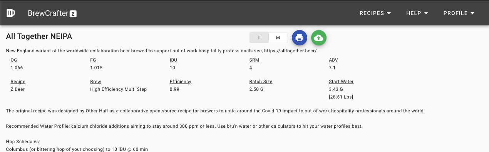

# BrewCrafter Plugin

This is built as a chrome extension that will add a second CTA button onto the "view" recipe experience of BrewCrafter.com (eventually to be added into the product natively). This new button has the "cloud-upload" icon and upon clicking will convert the recipe into a JSON recipe to be sent over the wire to the extension's configured Z local network address (ie. 192.168.42.1:80). This new "Push to Z" functionality was added in a recent Picobrew firmware labeled 0.0.119 which allows a JSON recipe to be pushed to the device and/or build from the embedded webserver included in that firmware release.

# Examples

Below are examples of the usage of this Chrome Extension.

## Modified Print Screen for "Push/Upload to Z" functionality

# References

[Chrome Web Store Listing](https://chrome.google.com/webstore/detail/brewcrafter-push-to-z/ggonfjkfjkakplblapnhiapdgemidpbp)
[Chrome Web Store Developer Dashboard](https://chrome.google.com/u/2/webstore/devconsole/69f16540-8fdc-4883-8455-c8b78d385850/ggonfjkfjkakplblapnhiapdgemidpbp/edit)